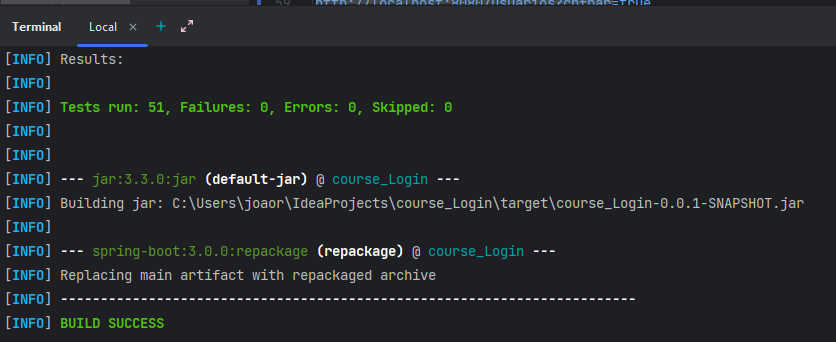
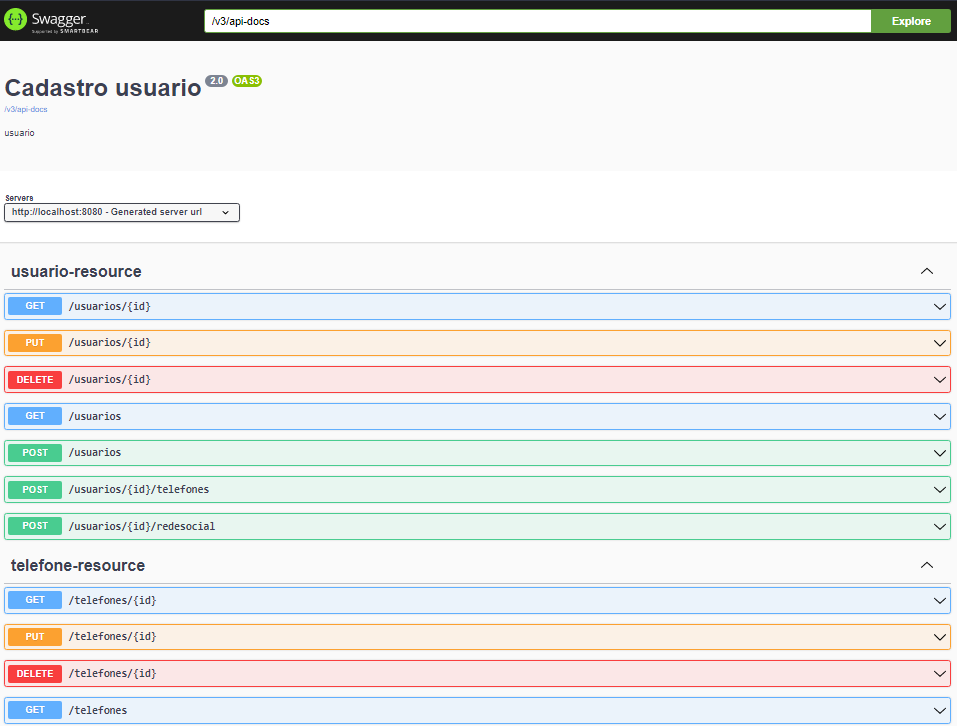
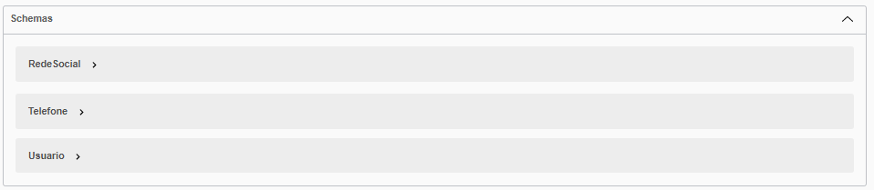

 
# POC 
Essa é uma POC de uma aplicação utilizando Java 17 com [Spring Boot](https://spring.io/projects/spring-boot) e uma base
de dados [PostgreSQL](https://www.postgresql.org/). para rodas as depêndencias externas foi utilizado o [Docker](https://www.docker.com/). Para os testes foram utilizados o [JUnit](https://junit.org/junit5/) e [Mockito](https://site.mockito.org/). E para
facilitar a geração de dados para os testes unitários e de integração foi utilizado [MockMVC](https://docs.spring.io/spring-framework/docs/current/javadoc-api/org/springframework/test/web/servlet/MockMvc.html)

## Conceito
A idéia é construir uma API REST de cadastro de usuário, onde cada usuário deverá cadastrar alguns atributos como cpf, email, senha, telefone e midia social que , similar a um cadastro de login de um novo usuário. Utilizando boas práticas de código, testes e refatoração de código, padrões API REST para elaboração de uma URL.
API para cadastro de um usuário, onde cada usuário deve cadastrar:
- email
- senha
- confirmação de senha
- cpf
- lista de telefones 
- lista de rede social 

## Stack
- Java 17
- Spring boot 3
- PostgreSQL
- Postman
- Docker file 
- API REST

## Estrutura do projeto
A estrutura do projeto foi criada baseada em alguns exemplos de DDD como
o [ddd-by-example](https://github.com/joolu/ddd-sample) e de Arquitetura Hexagonal como
o [Netflix](https://netflixtechblog.com/ready-for-changes-with-hexagonal-architecture-b315ec967749).
Basicamente temos 3 camadas:
* **resource**: Camada responsável por expor os endpoints da API e receber as requisições.
* **service**: Camada responsável por conter as regras de negócio e os domínios da aplicação.
* **repository**: Camada responsável por conter as implementações de infraestrutura como banco de dados, mensageria,
  etc.

## Testes

### Unitários
Os testes unitários são os testes mais simples e rápidos de serem executados.
Devem mockar todas as dependências externas a classe que está sendo testada.  
Eles são utilizados em diversas camadas da aplicação, mas principalmente na camada de **service**.

- **service**: Testes unitários dos *models* e *services*

### Integração

Os testes de integração são utilizados para integrações com serviços externos, como banco de dados e APIs. Utilizando Mock Mvc para fazer a cobertura da integração entre os frameworks.
- **resource**: Testes integrados dos *controllers* e *repository*

## SWAGGER
http://localhost:8080/swagger-ui/index.html



## Exemplos para testar
### 201 OK
Request
```
{
    "email": "gamiguel@gmail.com",
    "senha": "shazam",
    "confirmacaoSenha": "shazam",
    "cpf": "59358995076",
    "telefoneSet": [
        {
            "telefone": "22222222"
        }
    ],
    "redeSocialList":[
        {
             "midia": "Linkedin",
            "linkRede": "@Gamiguel"
        }
    ]
}
```

Response
```
{
    "id": 1,
    "email": "gamiguel@gmail.com",
    "senha": "shazam",
    "confirmacaoSenha": "shazam",
    "cpf": "59358995076",
    "telefoneSet": [
        {
            "id": 1,
            "telefone": "22222222",
            "novoId": null
        }
    ],
    "redeSocialList": [
        {
            "id": 1,
            "midia": "Linkedin",
            "linkRede": "@Gamiguel",
            "novoId": null
        }
    ]
}
```

## DOCKER
```
mvn clean
mvn package
docker build -t usuario-imagem .
docker run -p 8080:8080 -d usuario-imagem
docker ps
```


